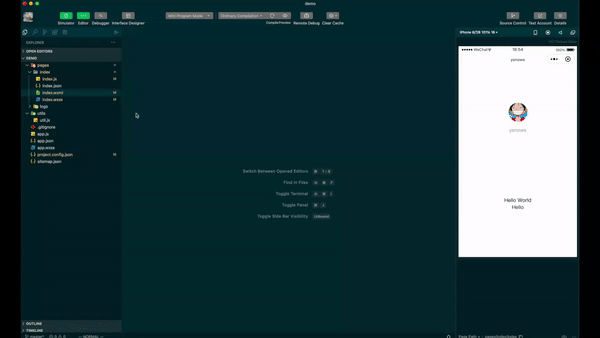

# relatedwxapp README

微信小程序开发者工具插件：switch between wxml,wxss,js 通过快捷键在微信小程序的wxml,wxss,js之间快速切换

## Features

> shift+cmd+; switch between wxml and js
> ctrl+cmd+; switch between wxml and wxss

## Release Notes

### 0.0.2

> optimize readme.md

### 0.0.1

> new publish

-----------------------------------------------------------------------------------------------------------

### For more information

https://github.com/ysnows/relatedwxapp

**Enjoy!**
